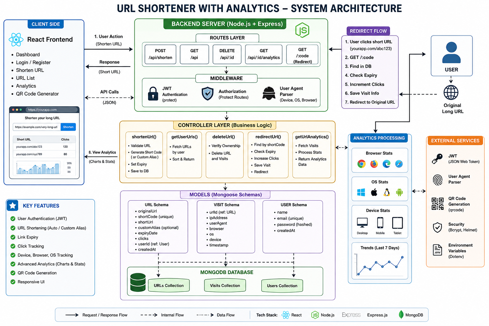

# 🔗 URL Shortener with Analytics

A full-stack URL Shortener web application built using **React, Node.js, Express, and MongoDB**.

---

## 🚀 Features

* 🔗 URL Shortening (Auto & Custom Alias)
* ⏳ Expiry Date for Links
* 📊 Analytics Dashboard
* 📱 Device, Browser, OS Tracking
* 📈 Click Trends (Last 7 Days)
* 🔐 JWT Authentication

---

## 🛠️ Tech Stack

* Frontend: React.js, Tailwind CSS
* Backend: Node.js, Express.js
* Database: MongoDB
* Auth: JWT

---

## ⚙️ Setup Instructions

### Clone repo

```bash
git clone https://github.com/your-username/url-shortener.git
cd url-shortener
```

### Backend

```bash
cd backend
npm install
npm start
```

### Frontend

```bash
cd frontend
npm install
npm run dev
```

---

## 🧠 Assumptions Made

* User must login to create/manage URLs
* Short codes are unique
* Expired links cannot be accessed
* Analytics stored separately for scalability

---

## 🤖 AI Planning & Architecture

### System Design Approach

* Used **MVC pattern (Model-View-Controller)**
* Separated analytics into a **Visit collection**
* Used **REST APIs for communication**
* Implemented **JWT-based authentication**

---

## 🏗️ Architecture Diagram



---

## 🔍 Architecture Explanation

* **Frontend (React)** handles UI and API calls
* **Backend (Express)** processes requests
* **Controllers** handle business logic
* **MongoDB** stores URLs, Users, Visits
* **Redirect Flow** tracks clicks and analytics

---

## 🎥 Demo Video

👉  YouTube link:

https://youtu.be/u0qTu6Oeh_s


---


This project is a part of a hackathon run by https://katomaran.com
